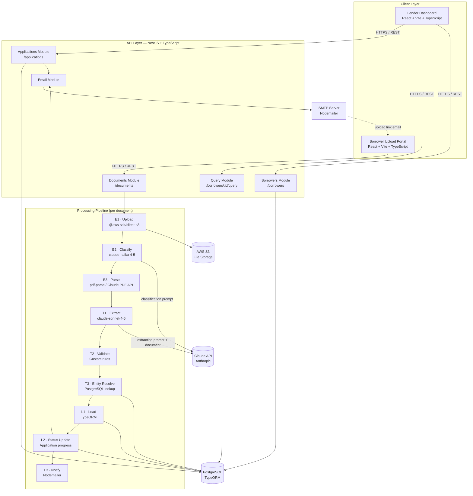

# System Design Document
## Loan Document Extraction & Orchestration Platform

---

## 1. Overview

This system is a two-sided loan document ingestion, extraction, and query platform. It enables lenders to create loan applications, collect documents from borrowers through a secure upload portal, and query structured financial data extracted from those documents using AI.

**Core problem:** Loan origination requires collecting and reviewing multiple heterogeneous documents from borrowers (tax returns, pay stubs, bank statements, employment verifications, etc.). These documents arrive in different formats, layouts, and structures. Manually reviewing them is time-consuming and error-prone. This system automates structured data extraction from the full document package and surfaces a unified, queryable borrower record with full source attribution.

**Two user roles:**
- **Lender (sales rep / loan officer):** Creates applications, monitors document collection progress, and queries extracted borrower data.
- **Borrower:** Receives a secure upload link via email, uploads their document package through a guided portal.

---

## 2. Architecture Overview

### 2.1 Component Diagram



### 2.2 Component Descriptions

| Component | Technology | Responsibility |
|---|---|---|
| **Lender Dashboard** | React + Vite + TypeScript | Create applications, monitor document collection status and completion %, view extracted borrower records, query structured data |
| **Borrower Upload Portal** | React + Vite + TypeScript | Token-scoped upload interface. Borrower uploads loan documents. Validates file type and size client-side before submission. |
| **Applications Module** | NestJS | Manages application lifecycle (`pending → uploading → processing → complete`). Generates upload tokens. Calculates completion percentage. |
| **Documents Module** | NestJS | Accepts file uploads. Computes SHA-256 hash for duplicate detection. Triggers the processing pipeline per document. |
| **Borrowers Module** | NestJS | Exposes the unified borrower record assembled from all processed documents. |
| **Query Module** | NestJS | Parameterized query interface over extracted borrower data (filter by income year, account type, document source, etc.). |
| **Email Module** | NestJS + Nodemailer | Sends the upload link to the borrower on application creation. Sends a completion notification to the lender when all documents are processed. |
| **Processing Pipeline** | NestJS service | Sequential per-document pipeline: upload → classify → parse → extract → validate → resolve → load → notify. Failure in one document does not block others. |
| **AWS S3** | AWS SDK v3 | Durable storage for original document files. Decoupled from the processing layer — files written once, never reprocessed. |
| **Claude API** | Anthropic SDK | Two-model strategy: `claude-haiku-4-5` for document classification, `claude-sonnet-4-6` for structured field extraction. |
| **PostgreSQL** | TypeORM | Primary data store for all structured entities: applications, documents, borrowers, income records, account records. |
| **SMTP Server** | Nodemailer | Outbound email delivery for borrower upload links and lender completion notifications. |

---

## 3. Data Pipeline Design

### 3.1 Pipeline Overview

The processing pipeline is executed **per document**, immediately after the file is accepted by the API. Each step updates the document's status in the database before proceeding, creating a durable audit trail of where the document is at any point in time. Failure in one document's pipeline does not affect other documents in the same application.

### 3.2 Document State Machine

Every document moves through the following states, persisted in the `documents` table:

```
PENDING
   │
   ▼
UPLOADING ──────── S3 write in progress (E1)
   │
   ▼
CLASSIFYING ─────── LLM type detection (E2)
   │
   ▼
PARSING ─────────── Content extraction (E3)
   │
   ▼
EXTRACTING ──────── LLM structured extraction (T1)
   │
   ▼
VALIDATING ──────── Field-level rule checks (T2)
   │
   ▼
RESOLVING ───────── Entity resolution across documents (T3)
   │
   ▼
LOADING ─────────── Writing to PostgreSQL (L1)
   │
   ▼
COMPLETE

At any step after UPLOADING, a transient or permanent failure transitions to:

FAILED { failed_at_step, error_code, retry_count, last_attempted_at }
```

The lender dashboard reads document status in real time. A failed document displays the step it failed at, the error code, and how many retries were attempted, giving the lender enough information to act (e.g., ask the borrower to re-upload).

### 3.3 Ingestion (E1)

1. Borrower submits a file through the upload portal (token-scoped `POST /documents/:token`)
2. Backend validates: magic bytes (`%PDF-`), file size (≤ 25 MB), content hash (SHA-256, duplicate check within the application)
3. File written to S3 at key `applications/{application_id}/documents/{document_id}/{filename}`
4. Document record created in PostgreSQL: `{ id, application_id, s3_key, filename, content_hash, status: UPLOADING }`
5. Pipeline triggered as a background task — HTTP response returns immediately to the borrower

### 3.4 Processing (E2 → T3)

| Step | Input | Output | Failure behaviour |
|---|---|---|---|
| **E2 Classify** | First-page text via `pdf-parse` | `document_type`, `confidence` | Retry up to 3× (LLM errors). Permanent fail → `UNRECOGNIZED` status |
| **E3 Parse** | S3 key | Raw text (text path) or base64 PDF (vision path) | Retry 3× for S3 read errors. Corrupt PDF → `FAILED` immediately |
| **T1 Extract** | Parsed content + type-specific prompt | Structured JSON + per-field confidence | Retry 3× with exponential backoff. Invalid JSON → `FAILED` |
| **T2 Validate** | Extracted JSON | Validated fields, flagged anomalies | No retry. Flags fields, does not discard. Never fails the pipeline. |
| **T3 Resolve** | Extracted identity (name, address, SSN-4) | `borrower_id` (new or existing) | Retry 2× for DB connection errors |

### 3.5 Storage (L1 → L2)

- **L1** writes to `income_records` and `account_records`, each row carrying `source_document_id` as a foreign key — every extracted field is traceable to the originating document
- Before normalised rows are written, the raw LLM JSON response is stored on the document record (`rawLlmJson`). This means if L1 fails, the extraction result is not lost and the load step can be replayed without re-calling the LLM
- **L2** recalculates `application.completion_pct` as `COMPLETE documents / total documents × 100`, written via `appRepo.update()` immediately after each document reaches `COMPLETE` status

### 3.6 Retrieval

The Query Module exposes parameterised read endpoints over the PostgreSQL data:

| Endpoint | Description |
|---|---|
| `GET /applications` | List all applications with status and completion % |
| `GET /applications/:id` | Application detail with document statuses |
| `GET /borrowers/:id` | Unified borrower record (identity + income + accounts + loan) |
| `GET /borrowers/:id/income` | Income history, filterable by year and source document |
| `GET /borrowers/:id/accounts` | Account records with statement dates and balances |
| `GET /borrowers/:id/documents` | All source documents with extraction status and provenance |

---

## 4. Pipeline Reliability and Fault Tolerance

### 4.1 The Synchronous vs. Queue Trade-off

The production-grade approach for a pipeline like this is a **message queue** (e.g., BullMQ + Redis or AWS SQS). A queue provides:

- **Durability** — jobs survive API server restarts and crashes
- **Automatic retry with configurable backoff** — built into the queue client
- **Dead letter queue (DLQ)** — permanently failed jobs are parked for inspection without polluting the main queue
- **Horizontal scaling** — multiple worker processes consume from the same queue independently
- **Observability** — queue depth, job throughput, failure rates are visible without custom instrumentation

However, for this implementation a queue introduces a non-trivial dependency surface: Redis or SQS must be provisioned, managed, and monitored alongside the API server. The configuration, error handling, and local development overhead add meaningful complexity that is disproportionate at the scale of this system (single-digit concurrent applications, 5–15 documents each).

**Decision: synchronous in-process pipeline with database-backed state and a cron-based auto-retry mechanism.**

This delivers the two most important properties — failure visibility and auto-recovery — without the operational overhead of a queue. The architecture is explicitly designed so that a queue can be slotted in by wrapping the existing pipeline service in a BullMQ job processor, requiring no redesign of the pipeline steps themselves.

This decision reflects a deliberate pragmatic tradeoff: the 80% solution that ships and works reliably under real constraints, with a documented and clear upgrade path.

### 4.2 Retry Strategy Per Failure Type

| Failure type | Retry | Strategy |
|---|---|---|
| LLM rate limit (HTTP 429) | Yes | Exponential backoff: 1 s → 2 s → 4 s, max 3 attempts |
| LLM server error (HTTP 5xx) | Yes | Same backoff |
| LLM returned invalid / unparseable JSON | No | Permanent failure — mark `FAILED` immediately |
| S3 network timeout | Yes | 3 attempts, 1 s fixed backoff |
| PostgreSQL connection error | Yes | 2 attempts, 1 s backoff |
| PDF corrupt / unreadable | No | Permanent failure immediately |
| Document classified as unknown type | No | Soft flag (`UNRECOGNIZED`), not a pipeline failure |

### 4.3 Cron-Based Auto-Retry

To handle the case where the API server crashes mid-pipeline — leaving a document stuck in a non-terminal state — the system runs a scheduled cron job every 5 minutes using `@nestjs/schedule`.

**What the cron does:**

```
Every 5 minutes:
  1. Query documents WHERE:
       status NOT IN ('COMPLETE', 'FAILED', 'UNRECOGNIZED')
       AND last_attempted_at < NOW() - 5 minutes
       AND retry_count < MAX_RETRIES (3)

  2. For each stuck document:
       a. Increment retry_count, update last_attempted_at
       b. Resume pipeline from the step matching current status:
            CLASSIFYING  → resume from E2
            PARSING      → resume from E3
            EXTRACTING   → resume from T1
            VALIDATING   → resume from T2
            RESOLVING    → resume from T3
            LOADING      → resume from L1 using stored rawLlmJson
                           (no LLM call needed — result already saved)

  3. If retry_count >= MAX_RETRIES (3):
       Mark document FAILED { failed_at_step: current_status, error_code: MAX_RETRIES_EXCEEDED }
       Surface failure in lender dashboard for manual resolution
```

**Why this works:**
- The state machine guarantees the cron knows exactly which step to resume from — no ambiguity about what has and has not been executed
- Storing `rawLlmJson` on the document record before the load step means the cron can replay L1 without re-calling the LLM, preserving both accuracy and cost
- Documents that fail permanently are caught by `MAX_RETRIES` and surfaced to the lender rather than retrying indefinitely
- No external dependency — implemented entirely within NestJS using `@nestjs/schedule`

**Limitations of this approach vs. a queue:**
- Recovery latency up to 5 minutes per stuck document (a queue recovers in seconds)
- Sequential retry scan — at high document volume, the cron becomes a bottleneck
- No guaranteed exactly-once execution — mitigated with a DB-level row lock on the document ID during retry

### 4.4 Upgrade Path to Queue-Based Processing

When volume demands it, the migration path is straightforward:

1. Introduce Redis + BullMQ (`@nestjs/bull`)
2. Wrap the existing `PipelineService` in a `DocumentProcessingJob` — pipeline step code does not change
3. Replace the cron retry logic with BullMQ's built-in retry and DLQ configuration
4. Replace the synchronous background trigger in the Documents Module with a job enqueue call
5. Scale horizontally by adding worker instances — no API server changes required

The database state machine and step-level status tracking remain identical in both designs. The pipeline is queue-ready by construction.

---

## 5. AI/LLM Integration Strategy

### 5.1 Direct Prompting vs. RAG

The first architectural decision in any LLM system is whether to use **Retrieval-Augmented Generation (RAG)** or **direct prompting**.

**RAG** is the right tool when:
- The knowledge base is large and cannot fit in a single context window
- The system needs to search across many documents to answer a query
- The same documents are queried repeatedly from different angles

**Direct prompting** is the right tool when:
- The full document fits comfortably within the model's context window
- The task is extraction from a specific, known document — not search
- Each document is processed once and its structured output stored durably

This system uses **direct prompting exclusively**. Each document is sent in full to the LLM with a targeted extraction prompt. The output is stored in PostgreSQL and queried through a standard API — the LLM is never involved in retrieval. Introducing RAG here would add a vector database, an embedding model, chunking logic, and retrieval tuning to a pipeline that does not need any of them. It would increase cost, latency, and operational complexity with no benefit to accuracy.

### 5.2 Two-Model Strategy

Two Claude models are used at distinct steps with different cost and capability profiles:

| Step | Model | Reason |
|---|---|---|
| E2 — Classification | `claude-haiku-4-5` | Low-complexity routing task. Determining document type from partial content is well within Haiku's capability. At ~$1.00/M input tokens it costs roughly 17× less than Sonnet for this step. |
| T1 — Extraction | `claude-sonnet-4-6` | High-complexity reasoning over noisy, multi-column, form-based layouts. Sonnet significantly outperforms Haiku on structured extraction from IRS forms, pay stubs, and mortgage disclosures where field-value relationships are visually implied rather than textually explicit. |

Classification is never done with Sonnet. Extraction is never done with Haiku. The boundary is clean.

### 5.3 Document Parsing Paths

Document content reaches the LLM through one of two paths, determined by the classifier at step E2:

| Path | Trigger | Mechanism | Document types |
|---|---|---|---|
| **Text path** | `confidence >= 0.75` + linear layout | `pdf-parse` extracts raw text → sent as string in user message | Bank statements, letters of explanation, title insurance, VOI reports |
| **Vision path** | `confidence >= 0.75` + structured form | PDF read from S3 → base64 encoded → sent as `document` type in Anthropic message API | Form 1040, W-2, pay stubs, closing disclosures, underwriting summaries |

The vision path uses Anthropic's native PDF document support — the raw PDF is sent directly to the model, which reads it as a human would: interpreting layout, column alignment, form fields, and spatial relationships between labels and values. This eliminates the need for intermediate image conversion and produces more reliable extraction on complex layouts.

### 5.4 Prompt Architecture

**Classification prompt (E2)**

The classification prompt is intentionally minimal. It sends the first page of text and asks for a structured response:

```
System:
  You are a document classifier for a mortgage loan origination system.
  Classify the document into exactly one of the following types:
  form_1040 | w2 | bank_statement | pay_stub | closing_disclosure |
  verification_of_income | letter_of_explanation | title_insurance |
  underwriting_summary | unknown

  Respond in JSON: { "document_type": string, "confidence": number (0–1), "reasoning": string }

User:
  [first-page text content]
```

**Extraction (T1) — Anthropic Tool Use**

Extraction uses Anthropic's tool use API with `tool_choice: { type: "tool" }` (forced call). Each `DocumentType` has a dedicated `Anthropic.Tool` with a full JSON Schema `input_schema` defining every expected field, its type, allowed enum values, and description. The model is required to call the tool — the response arrives as a pre-parsed `ToolUseBlock.input` object, not raw text.

This approach eliminates JSON parsing errors, hallucinated keys, and schema drift between the prompt and the downstream load step. The tool definitions live in `src/modules/pipeline/schemas/extraction.schemas.ts` as a `Record<DocumentType, Anthropic.Tool>` — adding a new document type requires only adding a new entry to this map, with no pipeline code changes.

Every schema includes an `extractionConfidence` field (required, `number 0.0–1.0`): the model's self-assessed confidence in the overall extraction quality. This is consumed by the validation step (T2) and drives the confidence threshold logic described in section 5.5.

Example tool definition (Form 1040):

```typescript
{
  name: 'extract_form_1040',
  description: 'Extract financial data from a Form 1040 US Individual Income Tax Return.',
  input_schema: {
    type: 'object',
    properties: {
      taxpayerName:          { type: 'string' },
      coTaxpayerName:        { type: 'string' },
      ssn:                   { type: 'string', description: 'XXX-XX-XXXX' },
      taxYear:               { type: 'integer' },
      filingStatus:          { type: 'string', enum: ['single', 'married_filing_jointly', ...] },
      adjustedGrossIncome:   { type: 'number' },
      extractionConfidence:  { type: 'number', description: '0.0–1.0' },
      // ... additional fields
    },
    required: ['taxpayerName', 'taxYear', 'adjustedGrossIncome', 'extractionConfidence'],
  },
}
```

```
System:
  You are a precise mortgage loan data extraction engine.
  Extract all financially relevant fields from the provided document using the supplied tool.
  Be thorough and accurate. If a field is not present in the document, omit it entirely.
  Never hallucinate or infer values that are not explicitly stated in the document.

User:
  [full document — text string or base64 PDF]
```

### 5.5 Confidence Scoring and Validation

Every tool schema includes a required `extractionConfidence` field (0.0–1.0) that the model populates with its self-assessed confidence in the overall extraction quality. This is the primary signal for the deterministic validation step (T2).

The validation step (T2) applies the following thresholds:

| Confidence | Action |
|---|---|
| `>= 0.90` | Accepted, stored as-is |
| `0.75 – 0.89` | Accepted, flagged `REVIEW_EXTRACTION_CONFIDENCE` in `_validationFlags` |
| `< 0.75` | Flagged `LOW_EXTRACTION_CONFIDENCE` — sets `BorrowerFlag.LOW_EXTRACTION_CONFIDENCE` on the borrower profile, surfaced to lender |
| Empty extraction | Flagged `EMPTY_EXTRACTION` regardless of confidence |

Classification confidence (from E2) is validated independently with the same thresholds and stored as `classificationConfidence` on the document record.

All extracted data is preserved regardless of confidence — nothing is silently discarded. The lender sees exactly what was extracted and at what confidence, with a direct link to the source document.

**Production extension:** per-field confidence (wrapping each field as `{ value, confidence }`) can be added to individual schema properties as the evaluation loop matures. The current top-level `extractionConfidence` is the minimum viable signal for the validation step and the confidence distribution metric (section 9.4).

### 5.6 Prompt Caching

Anthropic's prompt caching is applied to the system prompt of every extraction call. The system prompt contains the output schema definition and extraction instructions — content that is identical across all documents of the same type and changes only when the schema is updated.

```
[CACHED — system prompt, ~400–600 tokens per document type]
  Extraction instructions
  Output schema definition
  Formatting rules

[NOT CACHED — user message, varies per document]
  Document content (text or base64 PDF)
```

Cache writes cost 1.25× the standard input price. Cache reads cost 0.10× — a 90% reduction on the cached portion. Across a 10-document application, the system prompt is written once and read 9 times for documents of the same type, yielding meaningful cost savings at volume.

### 5.7 What the LLM Is Not Used For

The following tasks are handled deterministically without LLM involvement:

| Task | Method |
|---|---|
| Duplicate detection | SHA-256 content hash comparison |
| File type validation | Magic bytes check (`%PDF-`) |
| Entity resolution | Exact + fuzzy string match on name, address, SSN last 4 |
| Application completion % | Count of `COMPLETE` documents vs. expected types |
| Field validation rules | Deterministic checks (SSN format, income > 0, date ranges) |
| Retrieval / query | SQL queries via TypeORM |

Each of these tasks has a deterministic, cheap, and reliable implementation. Routing them through an LLM would add latency, cost, and non-determinism where none of those properties are beneficial.

---

## 6. Document Format Variability

### 6.1 The Challenge

The loan document corpus contains 9 distinct document types produced by different institutions, government agencies, and software systems. Each has a different layout, field naming convention, density of information, and level of structure. A system that works only on well-formatted text would fail on IRS forms. A system that relies solely on visual layout would be slower and more expensive than necessary for plain-text documents. No single parsing strategy works across the full corpus.

### 6.2 Classification-First Routing

Rather than attempting to apply a generic extraction strategy to every document, the system classifies each document first and routes it to the appropriate parse path and extraction schema. This decision is made at step E2, before any meaningful extraction work begins.

```
Document uploaded
       │
       ▼
  E2: Classify (Haiku)
       │
       ├── document_type known, confidence >= 0.75
       │         │
       │         ├── linear layout  ──→ E3A: Text path (pdf-parse)
       │         │                              │
       │         └── structured form ──→ E3B: Vision path (Claude PDF API)
       │                                        │
       │                                        ▼
       │                              T1: Type-specific extraction prompt
       │
       └── document_type unknown or confidence < 0.75
                 │
                 ▼
           Status: UNRECOGNIZED — flagged in dashboard, not counted toward completion
```

### 6.3 Document Type Registry

Each supported document type has three properties defined in the system: its parse path, its primary extraction fields, and the specific data quality challenges it presents.

| Document Type | Parse Path | Key Extracted Fields | Variability Challenges |
|---|---|---|---|
| **Form 1040** | Vision | Taxpayer name(s), SSN, address, filing status, W-2 income, AGI, capital gains, additional income, tax year | Severely scrambled text when parsed as plain text. Multi-column layout collapses. Multi-page form. Joint returns add a co-borrower. |
| **W-2** | Vision | Employee name, SSN, employer name, EIN, wages (box 1), federal tax withheld, SS wages, Medicare wages, retirement plan, tax year | Many small labelled boxes. Numbers scattered across the form. Box 12 codes (C, D, V, W) require code-to-meaning mapping. |
| **Bank Statement** | Text | Account holder, institution, account number, account type, statement period, opening/closing balance, transaction list | Format varies by institution. Column order, date format, and description formatting differ across banks. |
| **Pay Stub** | Vision | Employee name, employer, pay period dates, gross pay, net pay, YTD gross, individual deduction lines, direct deposit account (masked) | No standardized format. Every payroll provider (ADP, Paychex, Gusto, manual) has a different layout. |
| **Closing Disclosure** | Vision | Borrower name(s), property address, sale price, loan amount, loan type, loan term, lender name, loan ID, closing date | CFPB-standardized form but dense. Multiple fees tables. Page count varies. |
| **Verification of Income (VOI)** | Text | Employer, employment status, hire date, job title, annual salary rate, multi-year income breakdown (base, overtime, commissions, bonus) | Issued by third-party services (The Work Number). Format is semi-structured but field positions vary by vendor version. |
| **Letter of Explanation (LOE)** | Text | Borrower name, address, phone, email, explanation subject, date | Free-form prose. No fixed structure. Information must be inferred from natural language. |
| **ALTA Title Insurance** | Text | Property address, insurer name, commitment date, policy type, proposed amount of insurance | Dense legal language. Relevant fields are scattered across multiple schedule sections. |
| **Underwriting Summary (UUTS)** | Vision | Borrower name, property address, property type, occupancy status, sale price, appraised value, review classification | Checkboxes and grid-based layout. Selected options are indicated by marks rather than text values. |

### 6.4 Known Data Quality Challenges in This Corpus

Beyond format variability, the specific document set used in this system presents four data quality challenges that the pipeline is explicitly designed to handle.

**Challenge 1 — Income appears in multiple documents with different numbers**

The same borrower's income is represented across four document types:

| Source | Scope | Amount (example) |
|---|---|---|
| W-2 (2024) | John's wages only | $117,040 |
| Form 1040 (2024) | Joint return — John + Mary | $143,920 |
| VOI | John's gross per employer records | $121,790 |
| Pay Stub (2025 YTD) | Current year, partial | $44,100 |

These are not conflicts — they represent different things: individual vs joint, taxable wages vs gross pay, prior year vs current YTD. Each is stored as a separate `income_record` row with its `source_document_id`, `income_type`, and `tax_year`. The lender sees all of them with full provenance and applies their own underwriting judgment. The system does not attempt to resolve or reconcile them into a single number.

**Challenge 2 — Multiple addresses across documents**

| Address | Appears in | Meaning |
|---|---|---|
| 175 13th Street, Washington DC 20013 | 1040, W-2, bank statement, pay stub, LOE | Borrower's current residence |
| 999 Test Place, Washington DC 20013 | Closing Disclosure | Property being purchased |
| 214 Overlook Drive, Brentwood TN 37027 | Underwriting Summary | Subject property (may differ from closing disclosure — requires lender review) |

The schema separates `borrower.current_address` (extracted from personal identity documents) from `loan.property_address` (extracted from transaction documents). The underwriting summary address discrepancy is flagged with `needs_review: true` and surfaced to the lender — the system does not silently collapse conflicting addresses.

**Challenge 3 — Duplicate documents**

Two documents in the corpus share a SHA-256 content hash (same file submitted twice). The system rejects the second upload at the API layer with `409 DUPLICATE_DOCUMENT` before any pipeline step runs. This prevents duplicate `income_record` and `account_record` rows from inflating the borrower's financial profile.

**Challenge 4 — Joint vs. individual records**

The Form 1040 is filed jointly for John and Mary Homeowner. All other documents are for John alone. The extraction schema for Form 1040 captures both `taxpayer_name` and `co_taxpayer_name` as separate fields. Entity resolution uses the primary taxpayer name and SSN as the anchor — the co-borrower is stored as a field on the borrower record rather than creating a second borrower entity.

### 6.5 Adding New Document Types

The system is designed to support new document types without pipeline changes. Adding a new type requires:

1. Adding the type identifier to the classification prompt's supported type list
2. Creating a new extraction prompt and JSON schema for that type
3. Adding a parse path assignment (`text` or `vision`) to the routing config
4. Adding any type-specific validation rules to T2

No pipeline code changes are required. The pipeline is data-driven — it reads the document type from the classifier and looks up the appropriate prompt, schema, and parse path from a configuration registry.

---

## 7. Scaling Considerations

### 7.1 Current Baseline

The baseline implementation is designed for a small number of concurrent loan applications (single digits), each with 5–15 documents. All processing is synchronous and in-process within a single NestJS instance. PostgreSQL is a single-node instance. S3 is already effectively unlimited.

The architecture has four identifiable bottlenecks, each of which becomes the limiting factor at a different scale level. These are addressed in order as volume grows.

### 7.2 Bottleneck Map

```
Bottleneck 1: In-process synchronous pipeline
  → Saturates at ~20 concurrent documents
  → Fix: async queue (BullMQ + Redis)

Bottleneck 2: Single PostgreSQL write instance
  → Write contention under concurrent pipeline load
  → Fix: connection pooling (PgBouncer) + read replica

Bottleneck 3: Single API/worker process
  → CPU and memory ceiling on one instance
  → Fix: horizontal scaling — separate API and worker tiers

Bottleneck 4: LLM rate limits
  → Anthropic enforces requests-per-minute limits per API key
  → Fix: request queue with backoff + Anthropic Batch API for non-urgent loads
```

### 7.3 10x Scale — ~100 concurrent documents, dozens of concurrent applications

At 10x, the in-process synchronous pipeline becomes the primary constraint. Multiple concurrent uploads block each other and degrade API response times.

**Changes required:**

| Component | Baseline | 10x |
|---|---|---|
| Pipeline execution | Synchronous, in-process | Async queue — BullMQ + Redis (`@nestjs/bull`) |
| Cron retry | `@nestjs/schedule` cron | BullMQ built-in retry + DLQ — cron retired |
| PostgreSQL connections | Direct pool (TypeORM default) | PgBouncer connection pooler in front of PostgreSQL |
| Read queries | Same instance as writes | Read replica for `/borrowers` and `/query` endpoints |
| LLM calls | Direct, sequential | Rate-limited queue with token bucket per document type |
| Deployment | Single Docker container | Docker Compose with separate `api` and `worker` services |

**What does not change at 10x:**
- S3 — already scales horizontally with zero config
- PostgreSQL schema — no restructuring needed
- Extraction prompts and schemas — unchanged
- Frontend — static SPA, served from CDN or S3

**Database indexes that must exist before 10x:**

```sql
CREATE INDEX idx_documents_application_id   ON documents(application_id);
CREATE INDEX idx_documents_status           ON documents(status);
CREATE INDEX idx_documents_content_hash     ON documents(content_hash);
CREATE INDEX idx_income_records_borrower_id ON income_records(borrower_id);
CREATE INDEX idx_income_records_document_id ON income_records(source_document_id);
CREATE INDEX idx_applications_status        ON applications(status);
CREATE INDEX idx_applications_upload_token  ON applications(upload_token);
```

These indexes are included in the initial schema migrations — they cost nothing at baseline scale and become essential at 10x.

**Estimated cost at 10x (100 applications/month):**

| Provider | LLM cost | Notes |
|---|---|---|
| Anthropic (Haiku + Sonnet) | ~$27.90/month | Standard pricing |
| Anthropic with prompt caching | ~$19/month | ~32% reduction on cached system prompts |
| Anthropic Batch API | ~$13.90/month | 50% discount, async processing, 24h SLA |

### 7.4 100x Scale — ~1,000 concurrent documents, hundreds of concurrent applications

At 100x, horizontal scaling of the processing tier is required. A single worker process cannot consume the queue fast enough, and a single PostgreSQL instance becomes a write bottleneck under concurrent pipeline load.

**Changes required:**

| Component | 10x | 100x |
|---|---|---|
| API tier | Single NestJS instance | Multiple NestJS API instances behind a load balancer (ALB) |
| Worker tier | Single BullMQ worker | Multiple BullMQ worker instances, horizontally scaled independently of API |
| PostgreSQL | Single node + read replica | Managed RDS (AWS) with Multi-AZ, read replicas for query endpoints |
| LLM throughput | Sequential queue | Anthropic Batch API for non-real-time extraction; concurrent request pool for real-time |
| Caching | No application cache | Redis cache for borrower records (TTL: 5 minutes) — avoids redundant DB reads on dashboard polling |
| Observability | Application logs | Structured logging (JSON) + metrics pipeline (Datadog or CloudWatch) tracking queue depth, pipeline step latency, LLM error rates, extraction confidence distribution |
| Storage | Single S3 bucket | Same S3 bucket — S3 already scales; add lifecycle rules to move processed originals to S3 Glacier after 90 days |
| Deployment | Docker Compose | ECS Fargate (API + worker as separate task definitions) or Kubernetes |

**Architectural diagram at 100x:**

```
                    ┌─────────────────────┐
                    │   Load Balancer      │
                    │   (AWS ALB)          │
                    └──────────┬──────────┘
                               │
              ┌────────────────┼────────────────┐
              ▼                ▼                ▼
        ┌──────────┐    ┌──────────┐    ┌──────────┐
        │ NestJS   │    │ NestJS   │    │ NestJS   │   API Tier
        │ API #1   │    │ API #2   │    │ API #3   │
        └────┬─────┘    └────┬─────┘    └────┬─────┘
             └───────────────┼───────────────┘
                             ▼
                    ┌─────────────────┐
                    │  Redis + BullMQ  │   Queue
                    └────────┬────────┘
                             │
              ┌──────────────┼──────────────┐
              ▼              ▼              ▼
        ┌──────────┐  ┌──────────┐  ┌──────────┐
        │ Worker   │  │ Worker   │  │ Worker   │   Worker Tier
        │  #1      │  │  #2      │  │  #3      │
        └────┬─────┘  └────┬─────┘  └────┬─────┘
             └─────────────┼─────────────┘
                           │
              ┌────────────┼────────────┐
              ▼            ▼            ▼
        ┌──────────┐ ┌──────────┐ ┌──────────┐
        │ RDS      │ │ RDS Read │ │  AWS S3  │
        │ Primary  │ │ Replica  │ │          │
        └──────────┘ └──────────┘ └──────────┘
```

**Estimated cost at 100x (1,000 applications/month):**

| Item | Monthly cost (est.) |
|---|---|
| LLM — Anthropic Batch API | ~$139 |
| RDS PostgreSQL (db.t3.medium, Multi-AZ) | ~$100 |
| ECS Fargate — API tier (3 tasks) | ~$60 |
| ECS Fargate — Worker tier (3 tasks) | ~$60 |
| Redis (ElastiCache t3.small) | ~$30 |
| S3 storage + transfer | ~$15 |
| **Total** | **~$404/month** |

At 100x, the system processes 1,000 loan applications per month at ~$0.40/application all-in. A B2B SaaS charging $50–200 per application has comfortable margin to absorb infrastructure and LLM costs.

### 7.5 What Does Not Need to Change at Any Scale

Some components in the current architecture require no modification regardless of scale:

| Component | Why it scales without changes |
|---|---|
| S3 file storage | Object storage scales horizontally by design. No partitioning or configuration changes needed. |
| Extraction prompts and schemas | Stateless and identical per document type. Scaling workers does not require prompt changes. |
| Document state machine | The state model works identically whether one or one thousand workers are processing documents. |
| Error handling and validation | Deterministic, stateless logic per document. Scales linearly with workers. |
| Frontend (React SPA) | Static assets served from CDN. Zero backend dependency at runtime for page rendering. |

---

## 8. Key Technical Trade-offs

This section consolidates the most significant design decisions made in this system. Each entry states what was chosen, what was not, and why. The full reasoning for each is documented in the relevant section above and in the Architecture Decision Records (`ADR.md`).

---

**Trade-off 1: Synchronous pipeline + cron retry vs. message queue**

| | Chosen | Alternative |
|---|---|---|
| **What** | In-process synchronous pipeline with `@nestjs/schedule` cron for auto-retry | BullMQ + Redis (or AWS SQS) queue |
| **Why chosen** | No additional service dependency. Cron provides genuine auto-recovery from server crashes using the database state machine. Queue-ready by construction — adding BullMQ requires wrapping the pipeline service in a job processor, not redesigning it. |
| **Cost of this choice** | Recovery latency up to 5 minutes for stuck documents. No sub-second retry. Not suitable for high-concurrency production load. |
| **When to upgrade** | When concurrent document volume exceeds ~20 and pipeline processing time degrades API response time noticeably. |

---

**Trade-off 2: Direct prompting vs. RAG**

| | Chosen | Alternative |
|---|---|---|
| **What** | Direct prompting — each document sent in full to the LLM with a targeted extraction prompt | RAG — chunk documents, embed, store in vector DB, retrieve at query time |
| **Why chosen** | Each document is processed once. The task is extraction from a known, bounded document — not search across a corpus. RAG adds a vector database, embedding model, chunking strategy, and retrieval tuning for zero benefit. Direct prompting is cheaper, faster, and more accurate for this use case. |
| **Cost of this choice** | Documents exceeding the model's context window cannot be processed in a single call. Mitigated by Claude's 200K token context, which accommodates any document in this corpus. |
| **When RAG becomes relevant** | If the system evolves to support semantic search across all processed borrower records (e.g., "find all borrowers with income > $100K in 2024"), a vector index over extracted text would be appropriate. |

---

**Trade-off 3: Dual parse path (text + vision) vs. vision-only**

| | Chosen | Alternative |
|---|---|---|
| **What** | Text extraction (`pdf-parse`) for simple documents, Anthropic PDF vision API for complex forms | Vision path for all documents regardless of type |
| **Why chosen** | Vision calls consume more tokens and cost more than text calls. Bank statements, letters of explanation, and title insurance documents have linear, readable text — sending them through the vision path wastes budget and adds latency with no accuracy gain. The classifier routes each document to the cheaper path when safe to do so. |
| **Cost of this choice** | Two code paths to maintain. Misclassification (routing a complex form to the text path) produces lower-quality extraction. Mitigated by confidence threshold on the classifier and the ability to re-route on retry. |

---

**Trade-off 4: Field-level flagging vs. rejection of low-confidence extractions**

| | Chosen | Alternative |
|---|---|---|
| **What** | Low-confidence fields are stored with a `needs_review` flag and surfaced in the lender dashboard | Low-confidence fields are discarded or the document is rejected |
| **Why chosen** | Discarding uncertain data silently is worse than surfacing it with a flag. A lender can verify a flagged field in seconds by opening the source document. Rejection forces a re-upload, which may not produce a better result if the source document is genuinely ambiguous. The system preserves all extracted data with its confidence signal and lets the human make the final judgment. |
| **Cost of this choice** | The lender dashboard must communicate confidence clearly. Poorly designed UI could lead lenders to accept flagged values without reviewing them. Mitigated by prominent visual indicators per field. |

---

**Trade-off 5: Storing raw LLM JSON before normalization**

| | Chosen | Alternative |
|---|---|---|
| **What** | Raw LLM extraction JSON stored on the document record before writing normalized rows to `income_records` / `account_records` | Write directly to normalized tables, no intermediate storage |
| **Why chosen** | If the load step (L1) fails after a successful LLM call, the extraction result is not lost. The cron can replay L1 using the stored JSON without re-calling the LLM, saving both cost and latency. It also provides a permanent audit trail of exactly what the model returned, which is useful for debugging extraction errors and evaluating model accuracy over time. |
| **Cost of this choice** | Additional column on the `documents` table (JSONB). Storage cost is negligible — raw extraction JSON is typically 2–5 KB per document. |

---

**Trade-off 6: Entity resolution post-extraction vs. pre-pipeline**

| | Chosen | Alternative |
|---|---|---|
| **What** | Borrower identity is resolved at step T3, after extraction | Borrower is pre-created by the lender and documents are attached to a known borrower ID |
| **Why chosen** | In the two-sided model, the lender only knows the borrower's email address at application creation time — not their full identity. The borrower's name, SSN, and address are discovered from the documents themselves. Pre-creating a borrower entity with no identity fields serves no purpose. Extraction-first, resolution-second is the correct ordering. |
| **Cost of this choice** | Entity resolution requires fuzzy matching logic and can fail if identity fields are missing or inconsistent across documents. Failure is surfaced as a flag, not a pipeline crash. |

---

**Trade-off 7: Relational database vs. document store**

| | Chosen | Alternative |
|---|---|---|
| **What** | PostgreSQL with a normalized relational schema | MongoDB or DynamoDB with a document-oriented model |
| **Why chosen** | The output of this system is highly relational: borrowers have many income records, income records reference source documents, documents belong to applications. Foreign keys enforce data integrity across these relationships. Source attribution (every income record points to exactly one document) is a first-class constraint, not an application-level convention. A document store would require manual enforcement of these invariants. |
| **Cost of this choice** | Schema migrations are required when the extraction schema evolves. JSONB columns on `rawLlmJson` and `extracted_fields` provide flexibility for per-document-type variation without sacrificing relational structure. |

---

**Trade-off 8: Income data — store all sources vs. reconcile into a single figure**

| | Chosen | Alternative |
|---|---|---|
| **What** | All income figures from all documents stored as separate rows with source attribution | Reconcile conflicting income figures into a single canonical income number per borrower per year |
| **Why chosen** | The same borrower's income appears across four document types with legitimately different values (W-2 wages vs. joint 1040 total vs. VOI gross vs. YTD pay stub). These are not conflicts — they measure different things. Reconciliation requires underwriting judgment that belongs to the lender, not the system. Any automated reconciliation would either be wrong or require rules complex enough to constitute a second system. The correct design stores everything with full provenance and surfaces it for human review. |
| **Cost of this choice** | The lender sees multiple income figures and must understand what each represents. Mitigated by clear labelling of `income_type`, `source_document_type`, and `tax_year` on every row. |

---

## 9. Error Handling Strategy and Data Quality Validation

### 9.1 Error Handling Architecture

All errors in the API layer are intercepted by a single global exception filter registered at the NestJS application level. No error bypasses it. The filter's job is to:

1. Catch every exception before it reaches the HTTP response
2. Map it to a standardized error envelope
3. Log the full internal context (stack trace, original error, request metadata) to the server-side log — never to the response
4. Return only the sanitized envelope to the client

**Standard error envelope:**

```json
{
  "error": {
    "code": "EXTRACTION_FAILED",
    "message": "The document could not be processed. Please re-upload a clearer copy.",
    "details": {
      "document_id": "3fa85f64-5717-4562-b3fc-2c963f66afa6",
      "failed_at_step": "EXTRACTING"
    }
  }
}
```

`code` — stable, machine-readable string. The frontend branches on this, never on `message`.
`message` — human-readable, safe to display. Contains no internal implementation detail.
`details` — optional structured context, safe to expose. Never contains stack traces, DB queries, S3 paths, or LLM API responses.

**Error classification:**

| Class | HTTP Status | Examples | Internal logging |
|---|---|---|---|
| Client input errors | 400, 401, 404, 409, 413, 422 | Invalid file type, duplicate document, invalid token | Warn — expected, no alerting |
| Pipeline failures | 422 | Extraction failed, LLM returned unusable output | Error — tracked, counts toward failure rate metric |
| Internal server errors | 500 | Unhandled exceptions, unexpected DB errors | Error + alert — requires investigation |

HTTP 500 responses never include any detail beyond `{ "error": { "code": "INTERNAL_ERROR", "message": "An unexpected error occurred." } }`. The full error is logged internally with correlation ID for tracing.

### 9.2 Validation Layers

Validation is applied at two layers. The frontend layer provides UX feedback without a server round-trip. The backend layer is the authoritative gate — it cannot be bypassed.

**Layer 1 — Frontend (UX gate)**

| Check | Trigger | User feedback |
|---|---|---|
| File extension | Not `.pdf` | Inline error before upload begins |
| MIME type | Not `application/pdf` | Inline error before upload begins |
| File size | > 25 MB | Inline error with size limit stated |
| Empty selection | No file chosen | Submit button disabled |

**Layer 2 — Backend (authoritative gate)**

| Check | Method | Error code on failure |
|---|---|---|
| Magic bytes | First 4 bytes must be `%PDF` | `CORRUPTED_FILE` |
| File size | Re-enforced server-side regardless of client check | `FILE_TOO_LARGE` |
| Content hash | SHA-256 compared against existing documents in this application | `DUPLICATE_DOCUMENT` |
| Upload token | Token must exist, belong to an open application, and not be expired | `INVALID_UPLOAD_TOKEN` |
| Application state | Application must not already be in `COMPLETE` or `CLOSED` status | `APPLICATION_CLOSED` |

### 9.3 Data Quality Validation (Step T2)

After LLM extraction (T1), every extracted document passes through a deterministic validation step. This step does not call the LLM — it applies rule-based checks to the structured JSON returned by T1.

**Validation rules by document type:**

| Document type | Field | Rule |
|---|---|---|
| Form 1040 | `ssn_masked` | Matches pattern `XXX-XX-NNNN` |
| Form 1040 | `total_income` | Must be > 0 if `w2_income` > 0 |
| Form 1040 | `adjusted_gross_income` | Must be ≤ `total_income` |
| Form 1040 | `tax_year` | Must be a 4-digit year between 2015 and current year |
| W-2 | `wages_box_1` | Must be > 0 |
| W-2 | `ein` | Matches pattern `NN-NNNNNNN` |
| W-2 | `tax_year` | Must be a 4-digit year |
| Bank statement | `ending_balance` | Must be ≥ 0 |
| Bank statement | `statement_period_end` | Must be after `statement_period_start` |
| Pay stub | `net_pay` | Must be < `gross_pay` |
| Pay stub | `pay_period_end` | Must be after `pay_period_start` |
| VOI | `original_hire_date` | Must be in the past |
| VOI | `annual_rate` | Must be > 0 |
| All types | `borrower_name` | Must not be null or empty |

**Validation outcomes:**

- **Rule passes** → field stored as-is
- **Rule fails on a non-critical field** → field stored, `validation_flags` array on document record updated with `{ field, rule, severity: 'warning' }`
- **Rule fails on a critical field** (name, income) → field stored, `needs_review: true` set on the record, flag with `severity: 'error'`
- **Pipeline never halts due to validation** → T2 always passes to T3 regardless of validation outcome

Validation failures are surfaced in the lender dashboard per document and per field. The lender can compare flagged values directly against the source document via the S3 link stored on the document record.

### 9.4 Extraction Evaluation Loop

A production AI system requires ongoing measurement of extraction quality. This system instruments the following signals to enable evaluation without a separate evaluation framework.

**Signal 1 — Confidence distribution per document type**

Every field returned by the LLM includes a `confidence` score. The system aggregates these into a per-document-type confidence distribution stored in the `extraction_metrics` table:

```
document_type | avg_confidence | pct_above_0.90 | pct_below_0.75 | sample_count
form_1040     | 0.91           | 84%            | 6%             | 47
bank_statement| 0.97           | 96%            | 1%             | 103
pay_stub      | 0.87           | 71%            | 12%            | 58
```

A drop in `pct_above_0.90` for a given document type without a change in document volume signals either a model regression or a new document format variant entering the corpus.

**Signal 2 — Extraction failure rate per document type**

Documents that reach `FAILED` status at step T1 are tracked by `document_type` and `error_code`. A spike in `EXTRACTION_FAILED` for a specific type indicates a prompt or schema issue.

**Signal 3 — Validation flag rate**

The ratio of documents with `validation_flags` to total processed documents, broken down by document type and flag rule. A rising flag rate on `total_income > 0` for Form 1040 could indicate the prompt is failing to locate that field under a new IRS formatting variant.

**Signal 4 — Manual spot-check register**

A lightweight `qa_reviews` table records cases where a lender or operator manually verified an extracted value against the source document and marked it as correct or incorrect. These records serve as a ground-truth sample for prompt regression testing when extraction schemas are updated.

**Regression check protocol on prompt updates:**

1. Before updating an extraction prompt, sample 10–20 recently processed documents of that type from the `qa_reviews` table where the extracted value was confirmed correct
2. Run the new prompt against those documents
3. Compare new output against the confirmed ground truth
4. Promote the new prompt only if accuracy on the sample set does not regress

This is a lightweight eval loop — no ML infrastructure required, no labelled dataset needed. It uses the system's own audit trail as the evaluation corpus.

### 9.5 Audit Trail

Every significant event in the system is recorded at the database level, not just in logs. Logs are ephemeral; the database is the durable record.

| Event | Where recorded |
|---|---|
| Document uploaded | `documents.created_at`, `documents.s3_key`, `documents.content_hash` |
| Pipeline step started | `documents.status` updated, `documents.last_attempted_at` |
| Pipeline step completed | `documents.status` advanced |
| Pipeline step failed | `documents.status = FAILED`, `documents.failed_at_step`, `documents.error_code` |
| LLM extraction result | `documents.rawLlmJson` (full LLM response, immutable) |
| Field validation flags | `documents.validation_flags` (array of flag objects) |
| Borrower record created | `borrowers.created_at`, `borrowers.source_document_id` (first document that created the record) |
| Income record written | `income_records.source_document_id` on every row |
| Retry attempted | `documents.retry_count` incremented, `documents.last_attempted_at` updated |
| Application status changed | `applications.status`, `applications.completion_pct`, `applications.updated_at` |
| Email sent | `applications.borrower_email_sent_at`, `applications.completion_email_sent_at` |

This audit trail answers the three questions a lender or operator will ask when something looks wrong: *What did the system extract? From which document? And what happened during processing?*

### 9.6 PII Encryption at Rest

All personally identifiable information stored in PostgreSQL is encrypted at the field level before it reaches the database. The database stores only ciphertext for PII fields — a full database dump exposes no readable personal data without the application encryption key.

**Mechanism: service-layer encryption via `EncryptionService`**

Encryption is applied explicitly in the service layer before writes, and decryption before reads. Each call site that handles a PII field invokes `EncryptionService.encrypt()` / `EncryptionService.decrypt()` directly. The entity stores the ciphertext string as-is.

```typescript
// EncryptionService — injected via NestJS DI
profile.ssn = this.encryption.encrypt(extracted['ssn'] as string);
record.accountNumber = this.encryption.encrypt(rawAccountNumber);
```

TypeORM column `ValueTransformer` was considered but not used. Transformers are plain static objects defined at decoration time — they execute outside the NestJS DI context and cannot inject `EncryptionService`, which holds the encryption key via `ConfigService`. Workarounds (module-level singletons, static key assignment) exist but break the DI model and make unit testing harder.

**Production path:** replace service-layer calls with a TypeORM `@EventSubscriber` — it hooks into `beforeInsert`, `beforeUpdate`, and `afterLoad` entity lifecycle events, has full access to the DI container, and enforces encryption transparently without requiring every call site to remember to encrypt. This is the correct long-term architecture; service-layer encryption is the pragmatic starting point.

**Algorithm: AES-256-GCM**

AES-256-GCM (Galois/Counter Mode) provides both confidentiality and integrity — it detects if ciphertext has been tampered with. Each encryption call uses a randomly generated IV (initialization vector) stored alongside the ciphertext. The same plaintext encrypted twice produces different ciphertext, preventing pattern analysis across rows.

**Key management:**

| Environment | Key source |
|---|---|
| Local development | `PII_ENCRYPTION_KEY` environment variable (`.env`, never committed) |
| Production | AWS KMS — key is never stored in the application; a data encryption key is derived per session |

**Fields encrypted at rest:**

| Table | Encrypted fields | Plaintext fields (needed for queries) |
|---|---|---|
| `borrowers` | `name_first`, `name_last`, `ssn_masked`, `current_address`, `email`, `phone` | `id`, `created_at`, `source_document_id` |
| `applications` | `borrower_email` | `id`, `status`, `completion_pct`, `upload_token`, `created_at` |
| `account_records` | `account_number_masked` | `id`, `borrower_id`, `source_document_id`, `account_type`, `balance`, `statement_date` |

**What is not encrypted and why:**

Income amounts, balances, dates, and tax years are stored in plaintext. These fields are required for range queries and aggregations (e.g., filter by income year, sort by balance). Encrypting them would require decrypting every row in memory before filtering — incompatible with SQL-level queries. These fields carry financial sensitivity but not direct personal identifiability on their own.

The `rawLlmJson` column on the `documents` table may contain PII embedded in the LLM response. This column is encrypted in full as a JSONB blob using the same AES-256-GCM transformer.

**Encryption does not substitute for access control.** In production, database access is restricted to the application service account. Direct developer access to the production database requires explicit approval and is logged. The encryption layer protects against data exposure from DB backups, snapshots, and misconfigured read replicas.

**Logger PII redaction**

Encrypting PII in the database is ineffective if the same values are written to application logs in plaintext. The NestJS logger is replaced with a custom logger that redacts PII before any log entry is written.

The custom logger intercepts every log call and applies two redaction strategies:

1. **Pattern-based redaction** — regex patterns match common PII formats regardless of field name:

| Pattern | Replacement |
|---|---|
| SSN: `\d{3}-\d{2}-\d{4}` | `[REDACTED-SSN]` |
| Email: standard RFC 5322 pattern | `[REDACTED-EMAIL]` |
| Phone: `[\+\d][\d\s\-\(\)]{7,}` | `[REDACTED-PHONE]` |

2. **Key-based redaction** — when logging objects (request bodies, extracted JSON), known PII field names are replaced before serialization:

```typescript
const PII_FIELDS = [
  'name_first', 'name_last', 'ssn_masked', 'ssn',
  'current_address', 'email', 'phone',
  'borrower_email', 'account_number_masked',
];
// Any object key matching this list → value replaced with '[REDACTED]'
```

Raw LLM responses (`rawLlmJson`) are never logged. The logger treats any field containing `raw_extraction` as a PII-adjacent payload and replaces the value with `[LLM-RESPONSE-REDACTED]` regardless of key name.

This means application logs are safe to forward to third-party log aggregators (Datadog, CloudWatch, Papertrail) without PII exposure — a requirement in any compliance-conscious deployment.

---
